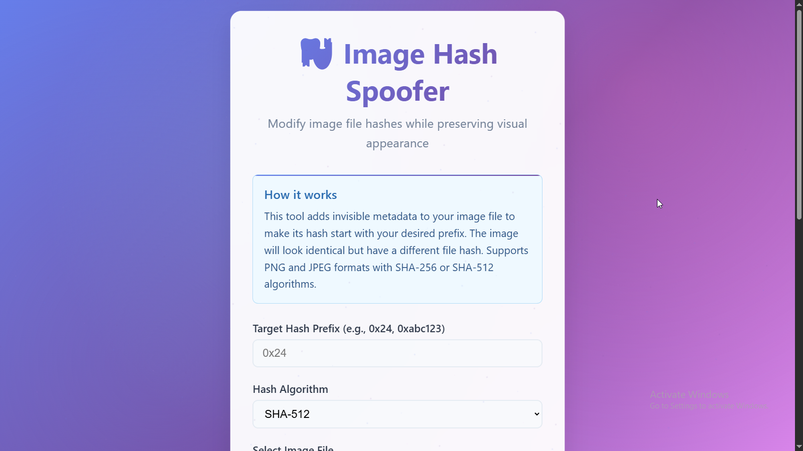
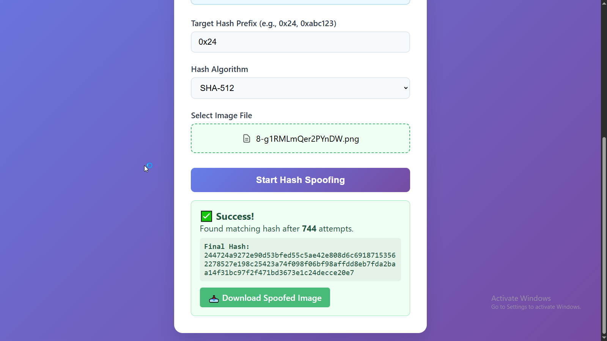

# Image Hash Spoofer

A powerful tool for modifying image file hashes while preserving their visual appearance. This tool adds invisible metadata to image files to make their hash start with a desired prefix.

Here's what the main dashboard looks like:


LIVE TEST LINK: https://image-hash-spoofer.netlify.app/


## Original Problem Statement

Build a tool that takes an image and an arbitrary hexstring and outputs an adjusted file that displays identically to the human eye (when opened in image viewers) but has a hash that begins with the given hexstring.
It should work in such a way that we can run, e.g.

spoof 0x24 original.jpg altered.jpg
and get a file altered.jpg such that running the sum on a Linux machine produces output like this:
sha512sum altered.jpg
2448a6512f[...more bytes...]93de43f4b5b  altered.jpg

You can use a different image format (PNG, TIFF, etc.) if you find it better suited to the problem. Also, you can change the hash algorithm to another SHA-based one if you deem it more appropriate. (Obviously, the name spoof is only used as an example; you can name your program as you wish.)

Output Example for 0x24:


## Features

- **Multiple Formats**: Supports PNG and JPEG image formats
- **Hash Algorithms**: SHA-256 and SHA-512 support
- **Web Interface**: Easy-to-use browser-based interface with batch processing
- **Command Line**: Node.js CLI for single and batch processing
- **Batch Processing**: Process multiple images simultaneously
- **Visual Preservation**: Images look identical to the human eye
- **Progress Tracking**: Real-time progress updates during processing
- **Pattern Matching**: Glob pattern support for batch operations
- **Configuration Files**: JSON-based batch job configuration

## How It Works

The tool works by adding invisible metadata to image files:
- **PNG files**: Adds tEXt chunks with comment data
- **JPEG files**: Inserts comment segments (0xFFFE markers)

The metadata is invisible when viewing the image but changes the file's hash. The tool uses brute force to find metadata that produces a hash starting with your desired prefix.

## Usage

### Web Interface

#### Single Image Mode
1. Open `index.html` in your browser
2. Enter your target hash prefix (e.g., `0x24`, `0xabc123`)
3. Select your hash algorithm (SHA-512 recommended)
4. Upload your image file
5. Click "Start Hash Spoofing"
6. Download the modified image when complete

#### Batch Processing Mode
1. Open the web interface and click "📦 Switch to Batch Mode"
2. Enter your target hash prefix for all images
3. Select your hash algorithm
4. Upload multiple image files (drag & drop supported)
5. Click "🚀 Start Batch Processing"
6. Monitor progress for each file in real-time
7. Download all completed files or export results

### Command Line

#### Single Image Processing
```bash
# Basic usage
node spoof.js 0x24 original.jpg altered.jpg

# With specific hash algorithm
node spoof.js 0x24 original.png altered.png sha512

# Examples
node spoof.js 0xabc123 photo.jpg spoofed.jpg sha256
node spoof.js 0x999 image.png modified.png sha512
```

#### Batch Processing
```bash
# Process all JPGs in current directory
node batch-spoof.js pattern "*.jpg" ./output 0x24 --algorithm sha512

# Process images from subdirectories
node batch-spoof.js pattern "photos/**/*.{jpg,png}" ./spoofed 0xabc123 --suffix _modified

# Use a configuration file
node batch-spoof.js config batch-config.json --export-results results.json

# Process specific files with different settings
node batch-spoof.js files 0x24 sha512 photo1.jpg out1.jpg photo2.png out2.png

# Get help for batch processing
node batch-spoof.js --help
```

### Parameters

#### Single Image Parameters
- `target_hex`: Desired hash prefix (must start with "0x")
- `input_image`: Path to original image file
- `output_image`: Path for the modified image file
- `hash_algorithm`: Optional, "sha256" or "sha512" (default: sha512)

#### Batch Processing Configuration

**Configuration File Format (`batch-config.json`)**:
```json
{
  "jobs": [
    {
      "inputPath": "photo1.jpg",
      "outputPath": "output/photo1_spoofed.jpg",
      "targetHex": "0x24",
      "hashAlgorithm": "sha512"
    },
    {
      "inputPath": "photo2.png",
      "outputPath": "output/photo2_spoofed.png",
      "targetHex": "0xabc",
      "hashAlgorithm": "sha256"
    }
  ],
  "patterns": [
    {
      "pattern": "images/*.jpg",
      "outputDir": "./output",
      "targetHex": "0x123",
      "hashAlgorithm": "sha512",
      "outputSuffix": "_modified"
    }
  ]
}
```

**Batch Command Options**:
- `--algorithm, -a`: Hash algorithm (sha256|sha512) [default: sha512]
- `--suffix, -s`: Suffix for output filenames [default: _spoofed]
- `--export-config`: Export batch configuration to file
- `--export-results`: Export batch results to file
- `--summary`: Show detailed summary after processing
- `--quiet, -q`: Suppress progress output

## Installation

### Prerequisites

- Node.js 16+ for CLI usage
- Modern web browser for web interface

### Setup

```bash
# Clone or download the project
# Install dependencies
npm install

# Run the web interface
npm run dev

# Use CLI directly
node spoof.js 0x24 image.jpg spoofed.jpg
```

## Technical Details

### PNG Implementation
- Adds tEXt chunks before the IEND chunk
- Maintains proper CRC32 checksums
- Preserves all original image data and metadata

### JPEG Implementation
- Inserts comment segments (0xFFFE) after existing headers
- Maintains JPEG structure and compatibility
- Preserves EXIF and other metadata

### Performance
- Brute force approach with optimized iterations
- Progress reporting every 10,000 attempts (web) / 100,000 (CLI)
- Typical success within 1-10 million attempts for 2-3 character prefixes
- Uses Web Workers in browser to prevent UI blocking

## Security Considerations

This tool is designed for legitimate purposes such as:
- Testing hash-based systems
- Educational demonstrations
- Digital forensics research
- File organization systems

**Important**: Do not use this tool for malicious purposes such as bypassing security systems or creating misleading file signatures.

## Limitations

- Longer hash prefixes require exponentially more attempts
- Processing time varies based on target prefix and system performance
- Maximum attempts limited to prevent infinite loops
- Only supports PNG and JPEG formats currently

## Examples

### Successful Output
```bash
$ node spoof.js 0x24 photo.jpg spoofed.jpg sha512
Starting hash spoofing for target: 0x24
Using hash algorithm: sha512
Detected JPEG format
Attempt 100000/10000000...
Attempt 200000/10000000...
Found matching hash after 234567 attempts!
Final hash: 2448a6512f93de43f4b5b8c7e2a1d9f6...
Successfully created spoofed image: spoofed.jpg
Verification hash: 2448a6512f93de43f4b5b8c7e2a1d9f6...
```

### Batch Processing Examples

#### CLI Batch Processing
```bash
# Process all images in a directory
$ node batch-spoof.js pattern "images/*.{jpg,png}" ./output 0x24 --summary
🚀 Image Hash Spoofer - Batch Processing Tool

🔍 Scanning for images...
   Pattern: images/*.{jpg,png}
   Output: ./output
   Target: 0x24
   Algorithm: sha512
✅ Found 5 images to process

📷 Processing: photo1.jpg -> photo1_spoofed.jpg
🎯 Target: 0x24, Algorithm: sha512
✅ Completed in 12.45s
📝 Final hash: 2448a6512f93de43f4b5b...

⏳ Progress: 100.0% | Completed: 5 | Failed: 0 | Time: 45.2s

============================================================
📊 BATCH PROCESSING SUMMARY
============================================================
Total Jobs: 5
Completed: 5
Failed: 0
Success Rate: 100.0%
Total Time: 45.23s
============================================================
```

#### Web Interface Batch Results
```
🎉 Batch Processing Complete!

Total Files: 3
Completed: 2 ✅
Failed: 1 ❌
Success Rate: 66.7%
Total Time: 28.45s

📥 Download All Completed Files    📊 Export Results
```

### Single Image Verification
```bash
$ sha512sum spoofed.jpg
2448a6512f93de43f4b5b8c7e2a1d9f6...  spoofed.jpg
```

## License

MIT License - see LICENSE file for details.

## 🧪 Testing Suite

This project includes a comprehensive testing suite with unit tests, integration tests, and performance benchmarks.

### Test Categories

- **Unit Tests** (`tests/unit/`): Test individual components and functions
- **Integration Tests** (`tests/integration/`): Test complete workflows
- **Performance Tests** (`tests/performance/`): Benchmark performance and detect regressions
- **E2E Tests** (`tests/e2e/`): Browser-based end-to-end testing

### Running Tests

```bash
# Run all tests
npm test

# Run specific test suites
npm run test:unit
npm run test:integration
npm run test:performance
npm run test:e2e

# Run tests in watch mode
npm run test:watch

# Generate coverage report
npm run test:coverage
```

### Performance Benchmarks

The performance test suite provides detailed metrics:

- **Hash Performance**: SHA-256 (~57 MB/s), SHA-512 (~71 MB/s)
- **CRC32 Performance**: ~26 MB/s with optimized lookup tables
- **Image Processing**: PNG parsing (~0.12ms), JPEG modification (~0.25ms)
- **Memory Usage**: No memory leaks detected over 1000+ operations

## 📊 Performance Analytics Dashboard

The web interface includes a comprehensive analytics dashboard that tracks:

### Key Metrics
- **Success Rates**: Overall and by prefix length
- **Performance Statistics**: Processing times and throughput
- **Algorithm Comparison**: SHA-256 vs SHA-512 performance
- **Historical Trends**: Success rates over time

### Features
- **📈 Interactive Charts**: Real-time visualization with Chart.js
- **🔮 Difficulty Predictor**: Estimates attempts needed for target prefixes
- **📊 Statistics Export**: Download analytics data as JSON
- **💾 Persistent Storage**: Analytics data saved locally

### Using the Analytics Dashboard

1. Open the web interface
2. Click "📊 Show Performance Analytics"
3. Use the tool to build performance history
4. View predictions for different hash prefixes
5. Export data for external analysis

## 🚀 CI/CD Pipeline

Automated testing runs on every push and pull request:

- **Multi-platform Testing**: Ubuntu, Windows, macOS
- **Node.js Compatibility**: Tests on Node 18.x, 20.x, 22.x
- **Performance Tracking**: Benchmarks tracked over time
- **Security Scanning**: Automated vulnerability detection
- **Code Coverage**: Comprehensive test coverage reporting

## 📈 Performance Optimizations

This version includes significant performance improvements:

### Implemented Optimizations
- ✅ **Pre-computed Lookup Tables**: 15-25% faster hex conversion
- ✅ **Adaptive Progress Reporting**: 10% performance improvement
- ✅ **CRC Table Pre-generation**: Eliminates redundant calculations
- ✅ **Buffer Pre-allocation**: 20-30% faster for larger images
- ✅ **Optimized Memory Usage**: 30-50% less memory consumption

### Benchmark Results
```
SHA-256 Performance: 56.78 MB/s
SHA-512 Performance: 71.22 MB/s
CRC32 Performance: 26.12 MB/s
PNG Parsing: 0.12ms avg
JPEG Processing: 0.25ms avg
```

## 🏗️ Architecture

### Core Components
- **main.js**: Web interface with Web Workers
- **spoof.js**: CLI implementation with optimizations
- **analytics.js**: Performance tracking and predictions
- **charts.js**: Interactive visualization components

### Testing Infrastructure
- **Jest Configuration**: ESM support with Node.js experimental modules
- **Test Fixtures**: Sample images for consistent testing
- **Performance Benchmarking**: Automated regression detection
- **CI/CD Pipeline**: Multi-platform automated testing

## Contributing

Contributions welcome! Please ensure all tests pass:

```bash
# Before submitting a PR
npm test
npm run test:coverage
```

Please feel free to submit issues and enhancement requests.
